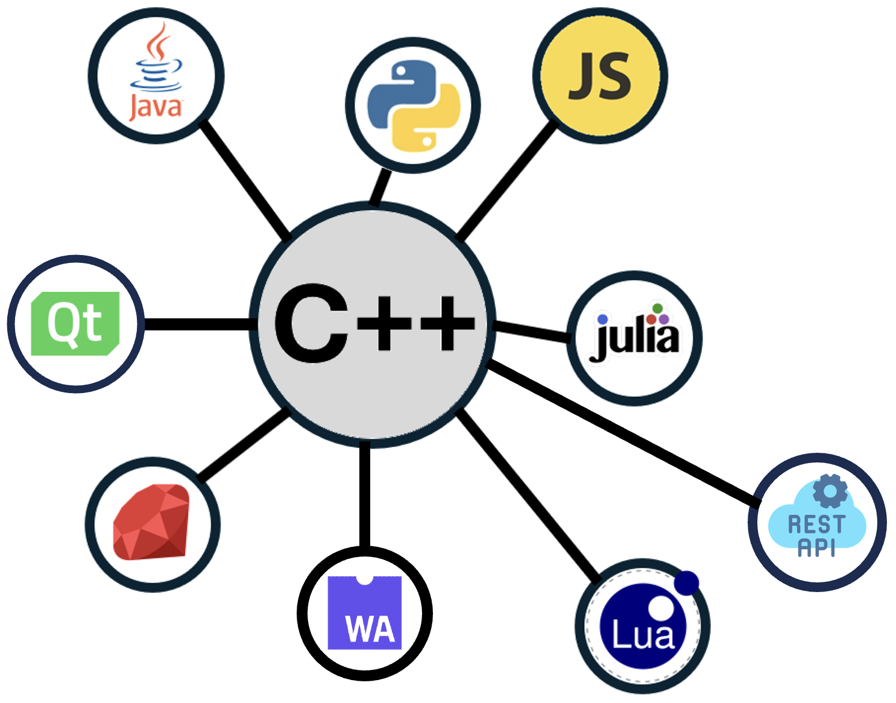
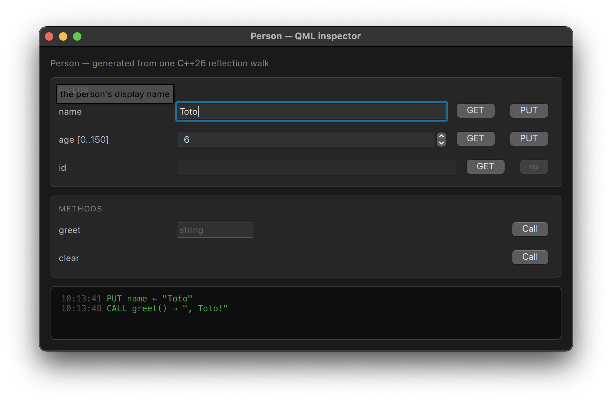

<!-- _class: invert lead -->

# Reflection in C++26 (P2996)

*Frantz Maerten*, Look Up Geoscience

<br>

June 11, 2026

---

## What is reflection?

> *"The ability of software to expose its internal structure."*

**Static** reflection: the **compiler** exposes structure at compile time

P2996 — one of the **largest** proposals in C++ history.

---

## Why should you care?

One C++ description → *everything*:

- **Automatic serialization / deserialization**
- **Generic struct printing / debugging**
- **Compile-time generation of types via splicers**
- **Doc generation** (md, html...)
- Annotations (P3394, paired with reflection) let you attach compile-time metadata to declarations and read it back via reflection, supporting things like validation rules or serialization hints.
- ...

---

## The two operators in one picture

```cpp
constexpr std::meta::info info = ^^Circle;            // reflect-on a type

typename [: info :] c = {.name = "c", .radius = 1.0};  // splice it back into code

// also works on members, expressions, namespaces, templates...
```

- Everything that crosses the boundary is `consteval` / `constexpr`
- `^^T` lifts the *name* `T` into a constexpr value (`std::meta::info`)
- `[: info :]` drops a `std::meta::info` value back into a *type*, *expression*, or *member*

---

## Why not earlier? — the design space

Every reflection system trades along the same axes:

| Axis | Endpoints |
|---|---|
| **When** | Compile-time only ↔ Runtime-queryable |
| **Intrusiveness** | Non-intrusive ↔ Macros / annotations required |
| **Source of metadata** | Native compiler ↔ External codegen ↔ Manual |
| **Target use** | Serialization ↔ Bindings ↔ GUIs ↔ RPC |

C++ historically lacked native reflection → **dozens** of libraries with different philosophies.

---

## Why not earlier? — C++ libraries pre-P2996

| Library | Type | Intrusive? | Coverage |
|---|---|---|---|
| **RTTI** (`typeid`) | language | none | type identity only |
| **Boost.PFR** | header | none | aggregates only |
| **magic_enum** | header | none | enums (via `__PRETTY_FUNCTION__`) |
| **RTTR** | header | macro | fields, methods, inheritance |
| **EnTT::meta** | header | registration | data + funcs (games) |
| **Boost.Describe** | header | macro | members + bases |
| **Qt MOC** | codegen | `Q_OBJECT` | full + signals/slots |
| **Unreal UHT** | codegen | `UCLASS` | full + GC + Blueprint |
| **SWIG** | codegen | none | multi-language bindings |

---

## Why not earlier? — every other language has this

| Language | Runtime | Compile-time | Idiom |
|---|---|---|---|
| **Python** | 🟢 deep | ⚪ | `inspect`, `getattr`, decorators |
| **Java** | 🟢 native | 🟡 processors | `java.lang.reflect` |
| **JavaScript** | 🟢 Proxy | ⚪ | `Reflect`, `Object.*` |
| **Rust** | 🔴 minimal | 🟢 proc-macros | `derive`, `serde`, `bevy_reflect` |
| **C++26** | 🟡 build manually | 🟢 P2996 | `^^T`, `[: r :]`, `consteval` |

C++ was **the only major language without first-class reflection** — until now.

---

## Lessons from the neighbours

- **D** is the spiritual ancestor of P2996 — `__traits` + `static foreach` shaped the C++26 design.
- **Rust `bevy_reflect`** proves runtime registries can stay idiomatic.
- **Go's struct tags** map cleanly onto P3394 annotations.
- **C# attributes + source generators** — cleanest runtime/codegen hybrid.

> C++26 closes the **language-level** gap.
> Runtime registries (Rosetta, RTTR, EnTT) don't go away — they get **auto-filled**.

---

## Supported compilers

| Compiler | Reflexion C++26 | `template for` |
  |---|---|---|
  | **GCC 16.1+** | ✅ Almost done | ✅ | 
  | **Clang (Bloomberg)** | ✅ Almost done | ✅ (`-freflection-latest`) | 
  | **Clang mainline** | 🟡 Partial | 🟡 In progress |
  | **MSVC** | ❌ | ❌ | 
  | **EDG** | 🟡 Partial | 🟡 | 

---

## A running example

```cpp
struct Point {
    int    x;
    int    y;
    double z;
    double norm() const { return ...; }
    Point scale(double) const { return ...; }
};
```

---

## Enumerate `Point`'s fields

```cpp
constexpr auto ctx = std::meta::access_context::current();

constexpr auto fields = std::define_static_array(std::meta::nonstatic_data_members_of(^^Point, ctx));

template for (constexpr auto f : fields) {
    std::println(
        "  {} : {}",
        std::meta::identifier_of(f),
        std::meta::display_string_of(std::meta::type_of(f))
    );
}
```

Output:

```
  x : int
  y : int
  z : double
```

No macros, no inheritance, no registration, non intrusif. Just the type.

---

## Enumerate `Point`'s methods

```cpp
constexpr auto members = std::define_static_array(std::meta::members_of(^^Point, ctx));

template for (constexpr auto m : members) {
    if constexpr (is_exportable_member_function(m)) {
        std::print("  {} {}(", std::meta::display_string_of(std::meta::return_type_of(m)),
                    std::meta::identifier_of(m));

        bool first = true;
        template for (constexpr auto param: std::define_static_array(std::meta::parameters_of(m))) {
            if (!first) std::print(", ");
            first = false;
            std::print("{}", std::meta::display_string_of(std::meta::type_of(param)));
        }
        std::println(")");
    }
}
```

Output:

```
  double norm()
  Point scale(double)
```

---

## Simple JSON-ish serialization

```cpp
template <typename T>
std::string to_json(const T& obj) {
    std::string out = "{";
    bool first = true;
    template for (constexpr auto m : std::define_static_array(
                      std::meta::nonstatic_data_members_of(^^T))) {
        if (!first) out += ",";
        first = false;
        out += '"';
        out += std::meta::identifier_of(m);
        out += "\":";
        out += serialize_value(obj.[:m:]);  // your per-type value formatter
    }
    out += "}";
    return out;
}
```

---

# Serialization example

```cpp
enum class Color { Red, Green, Blue };

struct Address {
    std::string street;
    int         number;
};

struct Person {
    std::string              name;
    int                      age;
    bool                     active;
    Color                    favorite_color;
    Address                  home;
    std::vector<std::string> tags;
};

int main() {
    Person p{
        .name           = "Alice",
        .age            = 30,
        .active         = true,
        .favorite_color = Color::Green,
        .home           = {"Rue Pasteur", 42},
        .tags           = {"admin", "ops"},
    };

    std::println("{}", to_json(p));
}
```

---

# Serialization result

```json
{
    "name": "Alice",
    "age": 30,
    "active": true,
    "favorite_color": "Green",
    "home": {
        "street": "Rue Pasteur",
        "number": 42
    },
    "tags": [
        "admin",
        "ops"
    ]
}
```

---

## Aggregate example

Use `std::meta::define_aggregate`:
(previsouly called `std::meta::define_class` in draft)

```cpp
#include <meta>

struct Synthesized;  // incomplete — to be defined

consteval {
    std::meta::define_aggregate(^^Synthesized, {
        std::meta::data_member_spec(^^int,    {.name = "id"}),
        std::meta::data_member_spec(^^double, {.name = "value"}),
    });
}

// Synthesized is now: struct Synthesized { int id; double value; };
```

Etonish, nein ? 😀

---

## The example of Rosetta



- A C++ introspection & automatic language binding.
- Non intrusif
- Introspection **at runtime**
- Hand write registration à la `pybind11`

https://github.com/xaliphostes/rosetta

---

## Rosetta — *before* C++26

For each class, hand-write the registration:

```cpp
rosetta::Class<Shape>("Shape")
    .field("name", &Shape::name).doc("display name")
    .method("describe", &Shape::describe).doc("greeting")
    .method("area",     &Shape::area)
    .static_method("next_id", &Shape::next_id);

rosetta::Class<Circle>("Circle")
    .base<Shape>()
    .field("radius", &Circle::radius)
        .doc("radius in meters")
        .range(0.0, 1e6);

// ... repeat for Rectangle, every other type, every project ...
```

Real numbers from our internal lib: **~6000 lines** of glue.

---

## Rosetta — *with* C++26

Use C++ annotations (P3394) for doc, readonly, numeric range, alias, displayed-name...

```cpp
rosetta::register_reflected<Shape>();
rosetta::register_reflected<Circle>();
rosetta::register_reflected<Rectangle>();
```

That's it:
- Same registry
- Same downstream generators

**~100 lines** of `register_reflected` machinery — once, in the library — and *you never touch it again*!

---

# Rosetta before and after C++26 (# lines of code)
| **Spec** | **Before** | **After** |
|---|---|---|
|core|     5,903| 106|
|common|   2,380|0|
|js|       1,808| 204|
|py|       1,553| 90|
|rest|     3,327|305|
|wasm|     1,435|102|
|**Total**|     16,500|807|

---

## Applications — Auto language bindings

One C++ description, **N hosts**:

| Target | What reflection drives |
|---|---|
| **Python** | `pybind11` `def(...)`, `__init__`, dunder methods |
| **JavaScript** | Node.js N-API wrappers, getters/setters |
| **WebAssembly** | Emscripten `EMSCRIPTEN_BINDINGS` |
| **TypeScript** | `.d.ts` declaration files |
| **REST API** | HTTP routes mapped to methods, JSON I/O |
| **Lua / Ruby / Julia** | Sol2, Rice, CxxWrap |
| **Java/JNI**, **C#/.NET**, **Swift** | bridge generation |

The alternative is **N hand-maintained binding files** that drift as the C++ API evolves.

---

## Applications — Validation · Docs · Persistence · Live

- **Validation** — range, regex, not-null, cross-field invariants (from annotations).
- **Documentation** — Markdown / HTML / OpenAPI / Sphinx from `doc("…")`.
- **Persistence / ORM** — `CREATE TABLE`, migrations from class diffs.
- **Configuration & DI** — config-file → object hydration, CLI flag generation.
- **Live scripting / REPL** — every method auto-callable from the console.
- **Testing** — property-based, fuzzing, snapshot tests, binding-coverage.

---

## Applications — Serialization · GUI · REST

**Serialize:** JSON / XML / YAML / TOML / CBOR / MsgPack / Protobuf / HDF5 — *no schema needed*.

**GUI generation:**

- Qt property editors (`ObjectInspector<Circle>` for free)
- QML data binding, web forms, Blueprint-style node editors
- ImGui debug panels — sliders, color pickers, drag-floats per field
- ...

**REST / RPC:** each method → endpoint, each parameter → JSON field.

```cpp
for (auto cls : registry.list_classes())
    for (auto m : cls->methods())
        router.add(cls->name + "/" + m.name, &dispatch);
```

---

## Annotation is the leverage

One `[[=doc{...}, =range{...}]] double radius;` is **simultaneously**:

- A Python attribute
- A JavaScript getter/setter
- A REST endpoint
- A JSON-serializable element
- A Qt property in the inspector
- A documented entry in the reference
- A range-validated database column
- ...

> **Every line of registration unlocks features across multiple subsystems at once.**

---

## QML example

```cpp
struct Person {
    [[= rosetta::doc{"the person's display name"}]]
    std::string name;

    [[ = rosetta::doc{"age in whole years"}, = rosetta::range{0.0, 150.0} ]]
    int age = 0;

    [[ = rosetta::doc{"server-assigned identifier"}, = rosetta::readonly{} ]]
    std::string id;

    Person() = default;
    Person(std::string n, int a, std::string i): name(std::move(n)), age(a), id(std::move(i)) {}

    [[= rosetta::doc{"Returns a greeting prefixed by the given salutation."}]]
    std::string greet(const std::string &salutation) const {
        return salutation + ", " + name + "!";
    }

    void clear() {
        name.clear();
        age = 0;
    }
};
```

---

## QML example (suite)

<style scoped>
section { display: flex; flex-direction: column; }
.cols { display: grid; grid-template-columns: 1fr 1fr; gap: 1.5rem; align-items: center; }
.cols pre { margin: 0; font-size: 0.6em; }
.cols img { width: 100%; }
</style>

<div class="cols">

```cpp
Person person;
rosetta::ReflectedObject reflected;
rosetta::bind_qml<Person>(&reflected, person);

QQmlApplicationEngine engine;
engine.rootContext()->setContextProperty("inspector", &reflected);
```



</div>

---

## When *not* to use reflection

- **Hot inner loops** — virtual dispatch and `Any` boxing have measurable cost; keep numerical kernels typed.
- **Tiny throw-away tools** — registration is overhead if no extension needs it.
- **Highly templated header-only math types** — nothing to expose.
- **When compile-time reflection alone covers your needs** — skip the runtime registry.

Use it where leverage is high: APIs that cross language boundaries, are edited live, persisted, validated, documented, versioned — **application-shaped code**, not algorithmic kernels.

---

# References

- [Reflection proposal](https://www.open-std.org/jtc1/sc22/wg21/docs/papers/2025/p2996r13.html)
- [Python Bindings with Value-Based Reflection](https://www.open-std.org/jtc1/sc22/wg21/docs/papers/2023/p2911r0.pdf)
- [Using Reflection to Replace a Metalanguage for Generating JS Bindings](https://www.open-std.org/jtc1/sc22/wg21/docs/papers/2023/p3010r0.pdf)
- [Short video presentation for bindings](https://www.youtube.com/watch?v=TOKP7k66VBw)


---

# Questions?

---

---

# Example Python binding

```cpp
template <typename T> void bind(py::module_ &m, const char *py_name) {
    py::class_<T> cls(m, py_name);
    cls.def(py::init<>());

    // Fields
    template for (constexpr auto fld : std::define_static_array(std::meta::nonstatic_data_members_of(^^T, ctx))) {
        if constexpr (ro) {
            // readonly annotation -> Python read-only property
            cls.def_property_readonly(name, [](const T &self) -> MemberT {
                return self.[:fld:]; }, docstr);
            }
    }
    // Methods
    template for (constexpr auto fn : std::define_static_array(std::meta::members_of(^^T, ctx))) {
        if constexpr (is_exportable_member_function(fn)) {
            constexpr auto name  = std::define_static_string(std::meta::identifier_of(fn));
            constexpr auto m_doc = std::meta::annotation_of_type<doc>(fn);
            constexpr const char *mdoc = m_doc.has_value() ? m_doc->text : "";

            if constexpr (std::meta::is_static_member(fn)) {
                cls.def_static(name, &[:fn:], mdoc);
            } else {
                cls.def(name, &[:fn:], mdoc);
            }
        }
    }
}
```